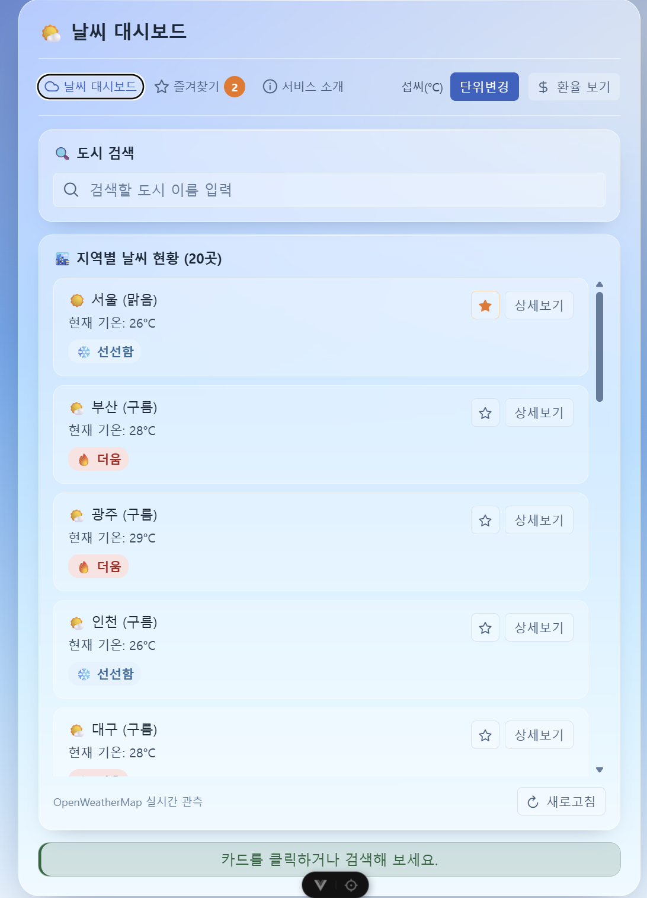
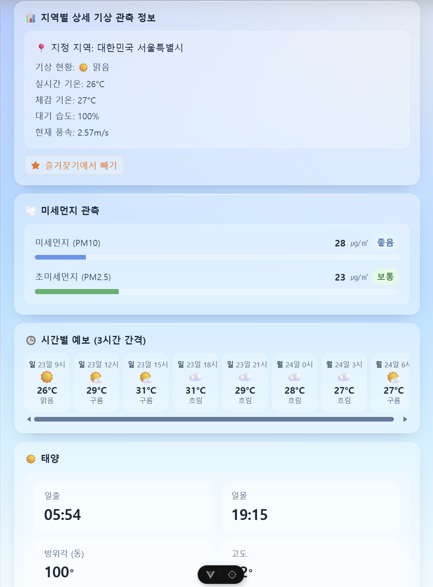
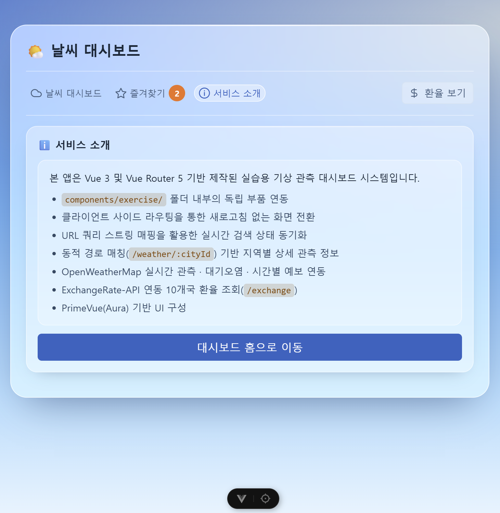
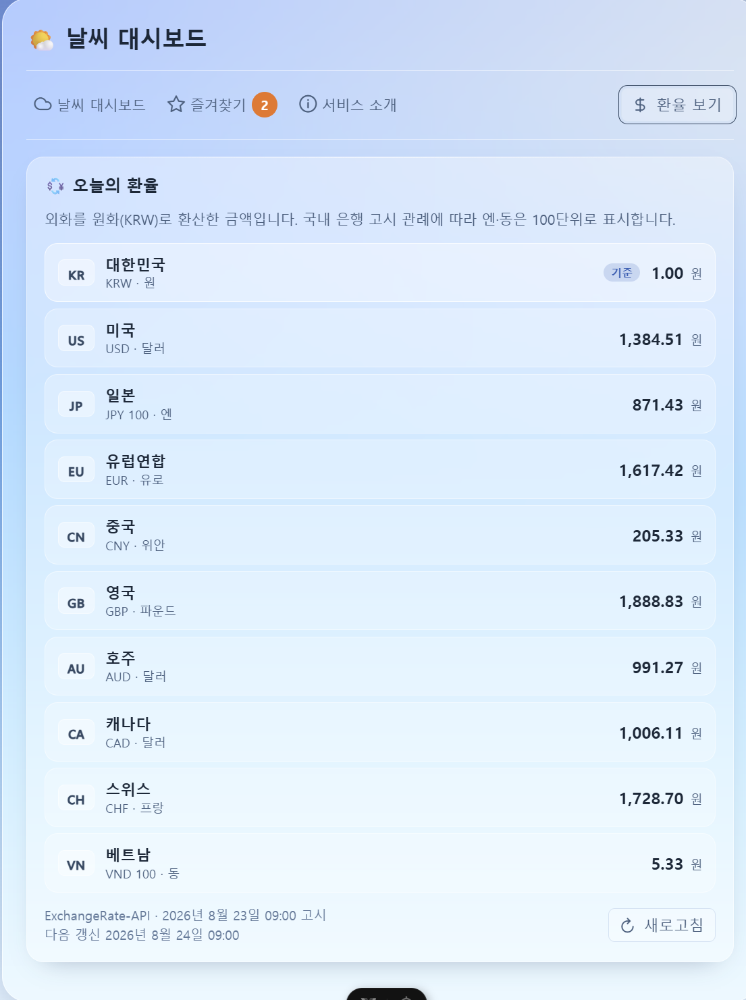

# 🌤️ 날씨 대시보드

> **날씨 API기반 도시의 날씨 상태 검색 Web**

## 목차

1. [프로젝트 소개](#1-프로젝트-소개)
2. [디렉토리 구조](#2-디렉토리-구조)
3. [화면 구성](#3-화면-구성)
4. [배포 주소 (데모)](#4-배포-주소-데모)
5. [주요 기능](#5-주요-기능)
6. [기술 스택](#6-기술-스택)
7. [시작하기](#7-setup-시작하기)
8. [요구사항 이행](#8-요구사항-이행)
9. [구현하며 판단한 내용](#9-구현하며-판단한-내용)
10. [트러블슈팅 요약](#10-트러블슈팅-요약)
11. [참고차료](#11-참고자료)

## 1. 프로젝트 소개

본 프로젝트는 SKALA에서 Vue3기반 과제의 요구사항 이행에 맞춰 진행한 실습 프로젝트이다. 날씨 대시보드에서 도시를 검색할 수 있고 검색한 도시는 상세보기를 통해 지역별 상세 관측 정보, 미세먼지 관측, 시간별 예보(3시간), 태양의 일출/일몰 시간을 확인할 수 있다. 또한 접속 시 현재 환율 정보를 확인할 수 있는 섹션도 준비되어 있다. Code challenge의 실습을 바탕으로 Hands on 종합 실습을 구성해 나갔으며, 최종적으로 vercel을 통해 배포까지 진행하였다.

> OpenWeatherMap 과 ExchangeRate-API 를 사용한 Vue 3 SPA.
> 전국 15개 도시와 해외 5개 도시의 현재 날씨 / 미세먼지 / 예보를 보여주고,
> 선택한 도시의 일출/일몰에 맞춰 배경 하늘이 바뀐다.

## 2. 디렉토리 구조

```
skala-vue/
│
├─ src/                            애플리케이션 소스
│  ├─ main.js                      진입점. Pinia / Router / PrimeVue(Aura) 등록 후 #app 에 마운트
│  ├─ App.vue                      바깥 껍데기. 내비게이션 바 + <RouterView> + Toast 자리
│  │
│  ├─ api/                         외부 API 호출 계층 (응답을 앱이 쓰는 모양으로 바꿔 넘긴다)
│  │  ├─ http.js                   API별 axios 인스턴스. 주소 / API Key / 타임아웃 / 에러 문구 변환
│  │  ├─ weather.js                OpenWeatherMap 호출 (현재 날씨 / 대기오염 / 5일 예보)
│  │  └─ exchange.js               ExchangeRate-API 호출 (환율)
│  │
│  ├─ stores/                      Pinia 스토어. 여러 화면이 함께 보는 상태만 둔다
│  │  ├─ weather.js                날씨 데이터 + 캐시 + 로딩/실패 상태
│  │  ├─ exchange.js               환율 데이터. weather.js 와 같은 구조로 맞춤
│  │  ├─ favorites.js              즐겨찾기 도시 id 목록. localStorage 에 저장
│  │  ├─ configStore.js            온도 단위(섭씨/화씨) 설정. 유일하게 Options 스타일
│  │  └─ selectedCity.js           지금 보고 있는 도시. 하늘 배경의 기준 (저장하지 않음)
│  │
│  ├─ views/                       라우트 하나에 대응하는 페이지 컴포넌트
│  │  ├─ WeatherHomeView.vue       /                    메인 대시보드. 도시 검색과 카드 목록
│  │  ├─ WeatherDetailView.vue     /weather/:cityId     상세. 기온 / 미세먼지 / 예보 / 태양 위치
│  │  ├─ WeatherFavoriteView.vue   /favorites           즐겨찾기한 도시만 모아 보기
│  │  ├─ ExchangeRateView.vue      /exchange            환율 화면 (10개국 통화)
│  │  ├─ WeatherAboutView.vue      /about               서비스 소개용 정적 페이지
│  │  └─ NotFoundView.vue          /:pathMatch(.*)*     404
│  │
│  ├─ components/exercise/         화면을 구성하는 부품. 상태를 갖지 않고 props 로 받아 표시한다
│  │  ├─ BaseDashboardCard.vue     카드 디자인 껍데기. 내용은 전부 <slot> 으로 주입받는다
│  │  ├─ WeatherCard.vue           도시 한 개의 날씨 카드 (즐겨찾기 토글만 스토어를 직접 쓴다)
│  │  ├─ ForecastList.vue          5일/3시간 예보를 가로 스크롤 목록으로
│  │  ├─ DustGauge.vue             미세먼지 수치 하나를 숫자 + 막대 + 등급 뱃지로
│  │  ├─ SearchBar.vue             도시 검색 입력창. 검색어는 부모가 소유한다
│  │  ├─ UnitToggler.vue           섭씨/화씨 전환 버튼. configStore 의 action 만 호출
│  │  └─ SelectedInfo.vue          대시보드 맨 아래 선택 상태 표시 바
│  │
│  ├─ composables/                 여러 곳에서 쓰는 로직을 함수로 뺀 것
│  │  ├─ useSkyTheme.js            지금이 낮/노을/밤 중 무엇인지 정해 <html data-sky> 에 적는다
│  │  └─ useNotice.js              안내 문구(Toast) 래퍼. severity 와 표시 시간을 한 곳에서 정한다
│  │
│  ├─ data/                        화면에 무엇을 보여줄지에 대한 고정 목록과 기준값
│  │  ├─ cities.js                 조회 대상 도시 20곳 — 국내 15 + 해외 5 (시차로 하늘 테마가 갈린다)
│  │  ├─ currencies.js             환율 화면이 다루는 10개국 통화 (ISO 4217 코드 / 표시 단위)
│  │  ├─ dustGrade.js              미세먼지 등급 기준과 계산. 컴포넌트 밖에 둬서 기준을 하나로 유지
│  │  └─ weatherCondition.js       OpenWeatherMap 상태 코드를 짧은 한글 단어로 (lang=kr 미사용)
│  │
│  ├─ utils/                       순수 계산 함수
│  │  ├─ time.js                   UTC 초 + 도시 오프셋을 그 도시의 현지 시각 문자열로
│  │  └─ sunPosition.js            위경도와 시각으로 태양의 방위각/고도 계산 (API 에 없는 값)
│  │
│  ├─ router/
│  │  └─ index.js                  라우트 정의. 모든 페이지를 동적 import 로 등록해 청크를 나눈다
│  │
│  └─ assets/
│     ├─ glass.css                 하늘 팔레트(낮/노을/밤)와 유리 패널 디자인 시스템
│     └─ theme.css                 PrimeVue 위에 얹는 전역 스타일. scoped 로 못 닿는 것만
│
├─ public/
│  └─ favicon.ico                  빌드할 때 dist/ 로 그대로 복사된다
│
├─ index.html                      Vite 진입 HTML. #app 과 main.js 를 연결한다
├─ vite.config.js                  Vite 설정. @ -> ./src 별칭
├─ vercel.json                     SPA 딥링크 폴백. 없으면 /exchange 새로고침이 404 가 된다
├─ jsconfig.json                   에디터가 @ 별칭을 알아보게 하는 설정 (빌드와 무관)
│
├─ package.json                    의존성과 스크립트 (dev / build / build:staging / lint / format)
├─ package-lock.json               설치 버전 고정
│
├─ eslint.config.js                ESLint 설정. 맨 뒤에 커스텀 규칙 (eqeqeq / no-console)
├─ .oxlintrc.json                  oxlint 설정. correctness 범주만 error 로
├─ .prettierrc.json                Prettier 설정 (세미콜론 없음 / 작은따옴표 / 100자)
├─ .editorconfig                   에디터 공통 규칙 (2칸 들여쓰기 / LF / UTF-8)
├─ .gitattributes                  줄바꿈 정규화. 커밋할 때 LF 로 통일한다
├─ .gitignore                      node_modules / dist / .env 계열 제외
│
├─ .env.example                    필요한 환경 변수 양식. 실제 키 값은 없다
├─ .env.local                      실제 API Key 2개. gitignore 대상이라 저장소에 없다
├─ .env.staging                    스테이징 모드 설정 (npm run build:staging)
├─ .env.production                 운영 모드 설정 (npm run build)
│
├─ .vscode/
│  └─ extensions.json              권장 확장 목록 (Vue / ESLint / oxlint / Prettier / EditorConfig)
│
├─ dist/                           빌드 산출물. npm run build 로 생성되며 커밋하지 않는다
└─ node_modules/                   설치된 패키지. 커밋하지 않는다
```

### 처음 받았을 때

`.env.local` 은 저장소에 없다. `.env.example` 을 복사해서 발급받은 키를 채워야
날씨와 환율이 뜬다.

```sh
cp .env.example .env.local
```

## 3. 화면 구성

|                                      첫 화면                                       |                                      도시 검색                                      |
| :--------------------------------------------------------------------------------: | :---------------------------------------------------------------------------------: |
|  |  |

|                                     날씨 즐겨찾기                                     |                                   날씨 상세보기                                    |
| :-----------------------------------------------------------------------------------: | :--------------------------------------------------------------------------------: |
|  |  |

|                                      서비스 소개                                       |                                       환율 보기                                       |
| :------------------------------------------------------------------------------------: | :-----------------------------------------------------------------------------------: |
|  |  |

## 4. 배포 주소 (데모)

**[skala-vue-ruby.vercel.app](https://skala-vue-ruby.vercel.app/)**

## 5. 주요 기능

|   분류    |                     핵심 기능                      |                                                                                     상세 내용                                                                                      |
| :-------: | :------------------------------------------------: | :--------------------------------------------------------------------------------------------------------------------------------------------------------------------------------: |
| 날씨 조회 |    20개 도시의 현재 기온, 습도, 풍속, 일출/일몰    | 표시할 수 있는 20개(국내 15개 + 해외 5개)의 데이터 기반으로 20개 도시 중 원하는 도시를 입력하면 입력 도시가 표시되고, 상세보기를 통해 해당 지역의 기상 관측 정보를 확인할 수 있다. |
| 미세먼지  |            PM10 / PM2.5를 등급과 색으로            |                 상세보기 페이지에 공해 오염 관측을 추가하여 미세먼지와 초미세먼지 농도를 확인하여 좋음, 보통, 나쁨, 매우 나쁨 4단계로 구분하여 게이지를 표시한다.                  |
| 5일 예보  |                     3시간 간격                     |                                          상세보기 페이지에 시간별 예보를 3시간 간격으로 데이터를 받아 21시간 동안의 날씨 정보를 표시한다.                                          |
| 즐겨 찾기 |    담아둔 도시만 모아 보기 (새로고침해도 유지)     |         날씨 대시보드에서 선호하는 도시를 즐겨찾기로 추가해서 해당 도시를 따로 즐겨찾기 페이지에서 관리할 수 있고 상세보기 버튼을 클릭해 상세보기 페이지로 넘어갈 수 있다.         |
| 단위 전환 |                    섭씨 / 화씨                     |                                      날씨의 온도 단위를 대시보드 상단에서 섭씨/화씨를 바꾸는 기능으로 우측 하단에 변경사항을 확인할 수 있다.                                       |
|   환율    |                    10개국 통화                     |           한국 포함 10개국(미국, 일본, 유럽연합, 중국, 영국, 호주, 캐나다, 스위스, 베트남)의 환율을 볼 수 있는 페이지. 그날의 환율을 볼 수 있고 다음날 09:00에 갱신된다.           |
| 하늘 테마 | 선택한 도시의 일출/일몰에 따라 낮 / 노을 / 밤 배경 |                                  날씨 대시보드에서 원하는 도시를 클릭하면 해당 도시의 시각에 따라 낮, 일몰/일출, 밤 3개의 테마 중 하나로 바뀐다.                                   |

## 6. 기술 스택

| 구분       | 기술            | 버전 | 선택 이유 / 사용 방식                                         |
| ---------- | --------------- | ---- | ------------------------------------------------------------- |
| 프레임워크 | Vue             | 3.5  | Composition API (`<script setup>`)                            |
| 라우팅     | Vue Router      | 5.0  | `createWebHistory` / 지연 로딩 / 동적 경로                    |
| 상태 관리  | Pinia           | 3.0  | 여러 화면이 함께 보는 상태만 스토어로 분리                    |
| HTTP       | Axios           | 1.19 | API별 인스턴스 + 인터셉터로 에러 문구 일원화                  |
| UI         | PrimeVue (Aura) | 4.5  | 컴포넌트가 갖춰져 있고 디자인 토큰으로 색을 바꿀 수 있어 선택 |
| 아이콘     | PrimeIcons      | 7.0  | PrimeVue 와 같은 계열이라 별도 설정 없이 사용                 |
| 빌드       | Vite            | 8.0  | 프로젝트 생성 시 기본                                         |

> **UI Library를 PrimeVue로 사용함으로써, 교재에 실리지 않은 개념인 `Toast`, `Message` 등 해당 컴포넌트들은 AI를 활용하여 적용하였다.**

**개발 도구** (`devDependencies`)

| 도구         | 버전 | 역할                                  |
| ------------ | ---- | ------------------------------------- |
| ESLint       | 10.8 | 문법/품질 검사 (커스텀 규칙 `eqeqeq`) |
| oxlint       | 1.60 | 빠른 1차 검사                         |
| Prettier     | 3.8  | 코드 서식 통일                        |
| Vue DevTools | 8.2  | 개발 중 컴포넌트/스토어 확인          |

**사용한 PrimeVue 컴포넌트**

Card / Button / InputText / IconField / InputIcon / Tag / Badge /
Message / ProgressBar / ProgressSpinner / Divider / Toast

## 7. setup 시작하기

### 7-1. 요구 사항

- **Node.js** 20.19 이상 또는 22.12 이상
- npm (Node.js 설치 시 함께 설치된다)

설치되어 있는지 확인:

```sh
node -v
npm -v
```

### 7-2. 저장소 복제

```sh
git clone https://github.com/youngminG044/skala-vue.git
cd skala-vue
```

### 7-3. 패키지 설치

```sh
npm install
```

`package.json` 에 적힌 라이브러리(Vue / Vue Router / Pinia / Axios / PrimeVue 등)를
한 번에 설치한다. 개별 설치 명령은 필요 없다.

### 7-4. 환경 변수 설정 (필수)

이 앱은 외부 API 두 곳을 사용한다. **API Key 가 없으면 화면에 데이터가 뜨지 않는다.**

`.env.example` 을 복사해 `.env.local` 을 만든다.

```sh
cp .env.example .env.local
```

> Windows 명령 프롬프트(cmd)에서는 `copy .env.example .env.local`

만들어진 `.env.local` 을 열어 두 줄의 값을 발급받은 키로 바꾼다.

```
VITE_OPENWEATHER_API_KEY=발급받은_키를_여기에
VITE_ExchangeRate_API_KEY=발급받은_키를_여기에
```

| 변수                        | 발급처                                               | 발급 방법                     |
| --------------------------- | ---------------------------------------------------- | ----------------------------- |
| `VITE_OPENWEATHER_API_KEY`  | [OpenWeatherMap](https://openweathermap.org/api)     | 가입 후 My API keys 에서 확인 |
| `VITE_ExchangeRate_API_KEY` | [ExchangeRate-API](https://www.exchangerate-api.com) | 가입 후 대시보드에서 확인     |

**주의할 점**

- 변수 이름의 **대소문자를 그대로** 맞춰야 한다.
  특히 `VITE_ExchangeRate_API_KEY` 는 가운데가 대문자로 시작한다.
- `VITE_` 로 시작하는 변수만 앱에 주입된다. 접두사를 빼면 `undefined` 가 된다.
- OpenWeatherMap-API와 ExchangeRate-API 모두 가입 확인 메일의 링크를 눌러 **이메일 인증까지** 마쳐야
  키가 동작한다. 인증 전에는 키가 맞아도 `inactive-account` 오류가 돌아온다.
- `.env.local` 은 `.gitignore` 대상이라 커밋되지 않는다.
  키가 저장소에 올라갈 일은 없다.

### 7-5. 개발 서버 실행

```sh
npm run dev
```

터미널에 뜨는 주소(기본 http://localhost:5173)를 브라우저에서 연다.

### 그 밖의 명령

| 명령                    | 하는 일                                  |
| ----------------------- | ---------------------------------------- |
| `npm run dev`           | 개발 서버 실행                           |
| `npm run build`         | 운영 빌드 -> `dist/` (`.env.production`) |
| `npm run build:staging` | 스테이징 빌드 (`.env.staging`)           |
| `npm run preview`       | 빌드 결과를 로컬에서 확인                |
| `npm run lint`          | ESLint + oxlint 검사 (자동 수정 포함)    |
| `npm run format`        | Prettier 로 `src/` 정리                  |

### 자주 겪는 문제

| 증상                            | 원인                               | 해결                                          |
| ------------------------------- | ---------------------------------- | --------------------------------------------- |
| "API Key가 설정되지 않았습니다" | `.env.local` 이 없거나 변수명 오타 | [7-4](#7-4-환경-변수-설정-필수)번을 다시 확인 |
| 날씨나 환율 중 화면이 안 나온다 | 이메일 인증 미완료                 | 가입 확인 메일의 링크 클릭                    |
| 키를 넣었는데 화면이 그대로다   | 환경 변수는 서버 시작 시 읽힌다    | 개발 서버를 껐다 다시 켠다                    |
| 잠시 후 데이터가 안 들어온다    | 무료 플랜 분당 60건 한도           | 1분 기다린 뒤 새로고침                        |

## 8. 요구사항 이행

과제는 누적 과제라, 앞 과제의 결과가 뒤 과제에서 대체되기도 한다.
현재 코드 기준으로 정리하였음.

### 과제 1 - Mockup

| 요구사항                                      | 구현                                    | 위치                  |
| --------------------------------------------- | --------------------------------------- | --------------------- |
| 배열 렌더링 `v-for`, `:key` 에 id 바인딩      | 도시 카드 반복 출력                     | `WeatherHomeView.vue` |
| 조건부 렌더링 `v-if` — 25도 기준 라벨         | `isHot` 으로 "🔥 더움 / ❄️ 선선함" 분기 | `WeatherCard.vue`     |
| 양방향 바인딩 `:value` / `@input` (한글 처리) | 도시 검색 입력창                        | `SearchBar.vue`       |
| 이벤트 수식어 — 상세보기 버튼 버블링 차단     | `@click.stop`                           | `WeatherCard.vue`     |
| **추가한 데이터**                             | **도시 20곳 (국내 15 + 해외 5)**        | `data/cities.js`      |

> 상세보기의 `window.alert` 는 **과제 4 요구사항 3번**에 따라 제거하고
> `router.push` 로 대체했다.

### 과제 2 — Composition API

| 요구사항                                 | 구현                                                                                                                | 위치                  |
| ---------------------------------------- | ------------------------------------------------------------------------------------------------------------------- | --------------------- |
| 반응형 상태 (검색어 / 선택 도시 / 목록)  | `ref` 로 정의                                                                                                       | `WeatherHomeView.vue` |
| `computed` 로 검색 필터링                | `filteredWeatherList`                                                                                               | `WeatherHomeView.vue` |
| `watch` — 선택 도시 변화 시 콘솔 로그    | 상태바 문구 변경 추적                                                                                               | `SelectedInfo.vue`    |
| `watchEffect` — 검색어 변화 추적         | 타이핑마다 콘솔 로그                                                                                                | `WeatherHomeView.vue` |
| 검색 결과 3가지 분기 표시                | 빈 검색어 / 일치 / 결과 없음                                                                                        | `WeatherHomeView.vue` |
| **추가한 반응형 변수 Computed, Watcher** | **검색 결과가 하나라도 있는지 여부의 `isCity` `computed` 외 `watch`를 사용해 검색어를 주소창 쿼리 스트링과 동기화** | `WeatherHomeView.vue` |

### 과제 3 — 컴포넌트 분리

| 요구사항                              | 구현                                                              | 위치        |
| ------------------------------------- | ----------------------------------------------------------------- | ----------- |
| `BaseDashboardCard.vue` — `slot` 배치 | 카드 디자인 공통화                                                | `exercise/` |
| `SearchBar.vue` — props / emits       | `update-query` 이벤트                                             | `exercise/` |
| `WeatherCard.vue` — props / emits     | `select-card` / `click-detail`                                    | `exercise/` |
| `<style scoped>` 로 디자인 분리       | 전 컴포넌트 적용                                                  | 전체        |
| **추가 Component 작성**               | **`DustGauge` / `ForecastList` / `UnitToggler` / `SelectedInfo`** | `exercise/` |

> `WeatherParent.vue` 는 **과제 4 요구사항 3번**에 따라
> `WeatherHomeView.vue` 로 대체했음.

### 과제 4 — Vue Router

| 요구사항                    | 구현                            | 위치                    |
| --------------------------- | ------------------------------- | ----------------------- |
| 지연 로딩 (Lazy Loading)    | 전 라우트 `() => import(...)`   | `router/index.js`       |
| Catch-all Route             | `/:pathMatch(.*)*` -> 404       | `router/index.js`       |
| Navigation Bar + RouterView | 상단 내비게이션                 | `App.vue`               |
| Programmatic Navigation     | `router.push('/weather/' + id)` | `WeatherHomeView.vue`   |
| 동적 경로 상세 페이지       | `/weather/:cityId`              | `WeatherDetailView.vue` |
| 서비스 소개 페이지          | `/about`                        | `WeatherAboutView.vue`  |
| **추가 view + 라우팅**      | **`/favorites` / `/exchange`**  | `views/`                |

### 과제 5 — Pinia Store

| 요구사항                                  | 구현                                                  | 위치                       |
| ----------------------------------------- | ----------------------------------------------------- | -------------------------- |
| `state: unit` (초기값 celsius)            | localStorage 에서 복원                                | `stores/configStore.js`    |
| `getters: unitSymbol` (°C / °F)           | 그대로 구현                                           | `stores/configStore.js`    |
| `actions: toggleUnit`                     | 섭씨 <--> 화씨 토글                                   | `stores/configStore.js`    |
| `UnitToggler.vue` 를 내비게이션 옆에 배치 | 상단 우측                                             | `exercise/UnitToggler.vue` |
| 메인 / 상세에 단위 설정 반영              | `convertTemp` 로 변환                                 | 각 화면                    |
| **추가 Store / getter / action**          | **스토어 4개 + `isFahrenheit`, `convertTemp` getter** | `stores/`                  |

### 과제 6 — Axios / 실제 API

| 요구사항               | 구현                                  | 위치              |
| ---------------------- | ------------------------------------- | ----------------- |
| Axios 설치 및 Key 발급 | `.env.local` 로 분리                  | `api/http.js`     |
| 실제 날씨 데이터 적용  | Current Weather (`/data/2.5/weather`) | `api/weather.js`  |
| **제공 API 추가 확장** | **Air Pollution, 5 Day Forecast**     | `api/weather.js`  |
| **기타 외부 API 확장** | **ExchangeRate-API (환율 10개국)**    | `api/exchange.js` |

### 과제 7 — UI Library

| 요구사항             | 구현                                                                              | 위치      |
| -------------------- | --------------------------------------------------------------------------------- | --------- |
| 외부 UI Library 적용 | PrimeVue 4.5 (Aura 프리셋)                                                        | `main.js` |
| 적용 컴포넌트        | Card / Button / InputText / Tag / Message / ProgressBar / ProgressSpinner / Toast | 전체      |

### 과제 8 — 품질 관리 / 배포

| 요구사항                        | 구현                          | 위치               |
| ------------------------------- | ----------------------------- | ------------------ |
| ESLint Error 0                  | 커스텀 규칙 `eqeqeq` 추가     | `eslint.config.js` |
| API Key 환경변수 / Git 미업로드 | `.env.local` + `.gitignore`   | `.gitignore`       |
| 프로젝트 빌드                   | `npm run build` → `dist/`     | —                  |
| 정적 파일 호스팅                | Vercel 배포 (+ SPA 폴백 설정) | `vercel.json`      |

## 9. 구현하며 판단한 내용

### 1) 즐겨찾기 상태를 컴포넌트가 아니라 스토어에 둔 이유

이 프로젝트는 "부모가 상태를 소유하고 props / emit으로 주고 받는다"를 원칙으로 삼았다. 그런데 즐겨 찾기는 홈 화면과 즐겨찾기 화면이 **함께 보는 상태**라 어느 한 부모도 소유할 수 없었다.

그래서 Pinia Store(`stores/favorites.js`)에 두고, 카드 컴포넌트가
부모를 거치지 않고 스토어를 직접 읽고 쓰게 했다. 그렇게 하지 않으면
카드를 쓰는 모든 화면이 같은 작업을 반복해야 한다.
원칙에서 벗어난 예외라는 사실을 컴포넌트 주석으로 남겨놓았다.

### 2) 더움 / 선선함 판단을 섭씨 원본으로 고정한 이유

표시 단위를 화씨로 바꿔도 **분류 결과가 달라지면 안된다**고 판단했다. 그래서 표시값(`displayTemp`)과 판단값(`city.temp`)을 분리하였다.

변환한 값으로 비교하면 반올림 때문에 경계 부근에서 결과가 달라질 수 있다.
섭씨 28도는 화씨 82.4도인데 화면에는 화씨 82도로 반올림 되어 표시되므로 `82 >= 82.4`가 거짓이 되어 같은 도시가 단위만 바꿨는데 "선선함"으로 바뀔 수 있다.

### 3) 하늘 테마 판단을 브라우저 시각이 아니라 도시 데이터로 한 이유

`new Date().getHours()`로 "18시면 노을" 같은 고정 규칙을 쓸 수도 있었다.
그러면 겨울 저녁 6시에 이미 캄캄한데 노을이 뜨는 테마가 적용된다.

대신 weather 스토어가 이미 가지고 있는 일출/일몰 시각과 관측 시각을 비교한다. 위도와 계절이 반영된 실제 관측값이다.
판단 기준이 **선택한 도시**라서, 시차가 있는 도시를 고르면 하늘도 그 도시를 따라간다.

### 4) 미세먼지 등급 기준을 컴포넌트 밖으로 분리한 이유

등급 계산을 컴포넌트 안에 두면 그 컴포넌트를 거치지 않는 화면에서 다시 쓸 수 없다. 같은 수치를 두 화면이 서로 다른 등급으로 말하는 것을 막으려고 `data/dustGrade.js`로 분리했다. 기준값이 한 곳에만 있다.

### 5) API Key는 프론트엔드만으로 숨길 수 없다

`.env.local`로 키를 옮기고 `.gitignore`에 넣었지만, 이것이 막아주는 것은 **저장소에 커밋되는 것까지**다.

Vite의 `VITE_` 변수는 서버에서 숨겨 읽는 값이 아니라 **빌드할 때 문자열로 치환**된다.
`dist/assets/*.js`를 열면 키가 평문으로 들어 있고, 배포된 앱을 여는 사람에게는 개발자도구 Network 탭에 그대로 보인다.

## 10. 트러블슈팅 요약

### 1) 빌드는 되는데 새로고침하면 404

**증상** — `npm run build` 후 `/exchange` 에서 새로고침하면 404.
개발 서버(`npm run dev`)에서는 멀쩡했다.

**원인** — `createWebHistory` 를 쓰는 SPA 는 주소가 여럿이지만 파일은
`index.html` 하나뿐이다. 정적 서버는 `/exchange` 라는 **파일**을 찾다 실패한다.
개발 서버가 이 폴백을 대신 해주고 있어서 개발 중에는 문제가 보이지 않았다.

**해결** — `vercel.json` 에 모든 경로를 `index.html` 로 보내는 rewrite 규칙 추가.
Vercel 이 Vite 를 자동 인식해도 이 설정은 붙지 않는다.

### 2) 상세 페이지에서 도시만 바꾸면 화면이 갱신되지 않는다

**증상** — `/weather/city_01` 에서 `/weather/city_03` 으로 이동해도
예보가 이전 도시 그대로였다.

**원인** — 라우트가 바뀌어도 **매칭되는 컴포넌트가 같으면**
Vue Router 는 컴포넌트를 재사용한다. `onMounted` 는 처음 한 번만 돌기 때문에
파라미터만 달라지는 이동에서는 실행되지 않는다.

**해결** — 파라미터를 `computed` 로 꺼내 `watch` 로 감시한다.

```js
const cityId = computed(() => route.params.cityId)

onMounted(load)
watch(cityId, load) // 같은 컴포넌트를 재사용하는 이동까지 커버
```

> **트러블슈팅은 여러 내역 중 특별히 중요하다고 생각되는 부분만 발췌하여 README.md 파일에 작성한 것이다. 더 다양한 트러블슈팅 내역을 확인하려면 troubleshooting.md를 참고하면 된다.**

## 11. 참고자료

**사용한 API**

- [OpenWeatherMap API](https://openweathermap.org/api) — 현재 날씨 · 대기오염 · 5일 예보
- [ExchangeRate-API](https://www.exchangerate-api.com) — 환율

**사용한 라이브러리**

- [Vue 3](https://vuejs.org) · [Vue Router](https://router.vuejs.org) · [Pinia](https://pinia.vuejs.org)
- [PrimeVue](https://primevue.org) · [Axios](https://axios-http.com) · [Vite](https://vite.dev)
